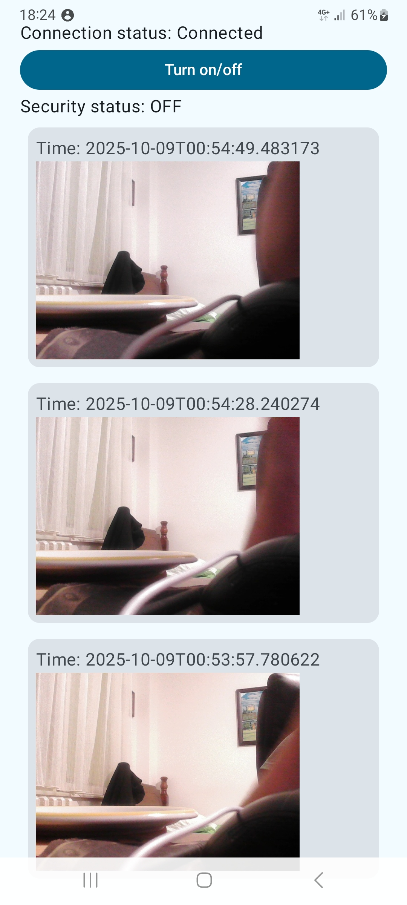

<!DOCTYPE html>
<html lang="en">
<head>
  <meta charset="UTF-8">
</head>
<body>

<h1>🔐 alarmSecuritySystem</h1>

  A smart motion-detection security system using Raspberry Pi Pico (C SDK), Raspberry Pi (Python), Firebase, and an Android app (Jetpack Compose). The system captures and sends real-time images when motion is detected.

## Features

### Core
- **End-to-end alarm pipeline:** Pico W detects motion → Raspberry Pi captures image → uploads to **Firebase** → **Android** app receives a push and displays the evidence.  
- **Remote control via MQTT:** The system can be **armed** or **disarmed** through MQTT messages (e.g., from the Android app).

### Pico W (Firmware)
- **Wi-Fi powered by FreeRTOS (CYW43 + lwIP):** Uses `pico_cyw43_arch_lwip_sys_freertos` so Wi-Fi and networking tasks run under FreeRTOS while main logic stays simple.  
- **MQTT client support:** Subscribes to a control topic (e.g., `pico/alarm/set`) to toggle system state and publishes status updates.  
- **Station mode (WPA2):** Auto-connects and reconnects to configured Wi-Fi SSID.   
- **Configurable credentials:** SSID/password and MQTT broker address defined in a config header or build-time defines.

### Raspberry Pi (Service)
- **Capture on trigger:** Listens for Pico W GPIO or network signal and captures an image (OpenCV / Pi Camera).  
- **Cloud upload:** Saves images to **Firebase Storage** and writes metadata to **Realtime Database**.  
- **Push notifications:** Sends **FCM** alerts to Android clients with image and timestamp.  
- **MQTT broker option:** Can host or relay MQTT messages for system control and status.

### Android (App)
- **Realtime alerts:** Receives Firebase Cloud Messaging notifications on motion events.  
- **System control:** Sends MQTT messages to arm/disarm the alarm remotely.  
- **Evidence viewer:** Displays captured images and event details.

<h2>🧠 Architecture Overview</h2>
<pre>
[ PIR Sensor ] --> [ Pico (C SDK) ]
         |                  |
         |        GPIO Signal (3.3V)
         ↓                  ↓
   [ LED + Buzzer ]     [ Raspberry Pi (Python) ]
                             |
                        Captures Image
                        Uploads to Firebase
                        Sends FCM Notification
                             ↓
                      [ Android App (Compose) ]
                      - Receives push alert
                      - Views image and timestamp
</pre>

<h2>🛠️ Tech Stack</h2>
<table>
  <tr><th>Component</th><th>Tech/Platform</th></tr>
  <tr><td>Microcontroller</td><td>Raspberry Pi Pico (C SDK)</td></tr>
  <tr><td>Central Processing</td><td>Raspberry Pi (Python 3)</td></tr>
  <tr><td>Camera</td><td>Pi Camera / OpenCV</td></tr>
  <tr><td>Cloud</td><td>Firebase Storage + Realtime DB</td></tr>
  <tr><td>Notification</td><td>Firebase Cloud Messaging (FCM)</td></tr>
  <tr><td>Mobile App</td><td>Android (Jetpack Compose, Kotlin)</td></tr>
</table>

<h2>🔧 Hardware Requirements</h2>
<table>
  <tr><th>Component</th><th>Description</th><th>Image</th></tr>
  <tr><td>Raspberry Pi Pico</td><td>Microcontroller running C SDK for motion detection.</td><td></td></tr>
  <tr><td>Raspberry Pi</td><td>Main processing unit running Python scripts.</td><td></td></tr>
  <tr><td>PIR Motion Sensor</td><td>Detects motion and triggers the Pico.</td><td></td></tr>
  <tr><td>LED</td><td>Visual motion detection indicator.</td><td></td></tr>
  <tr><td>Buzzer</td><td>Audible alert on motion detection.</td><td></td></tr>
  <tr><td>Pi Camera</td><td>Captures images when motion is detected.</td><td></td></tr>
</table>

<h2>📦 Installation</h2>

<h3>1️⃣ Raspberry Pi Pico (C SDK)</h3>
<ul>
  <li>Install the <strong>Pico SDK</strong> and <strong>CMake</strong>:
    <pre><code>
sudo apt update
sudo apt install cmake gcc-arm-none-eabi build-essential git
    </code></pre>
  </li>
  <li>Clone and set up the Pico SDK:
    <pre><code>
git clone https://github.com/raspberrypi/pico-sdk.git --branch master
export PICO_SDK_PATH=$PWD/pico-sdk
    </code></pre>
  </li>
  <li>Clone this project and build:
    <pre><code>
git clone https://github.com/milutin2002/alarmSecuritySystem.git
cd alarmSecuritySystem/pico
mkdir build && cd build
cmake -DWIFI_SSID="wifi_name" -DWIFI_PASS="wifi_password" ..
make
    </code></pre>
  </li>
  <li>Flash the generated <code>.uf2</code> to the Pico by holding BOOTSEL and connecting via USB.</li>
  <li>GPIO mapping:
    <ul>
      <li>PIR Sensor → GPIO17</li>
      <li>LED → GPIO13</li>
      <li>Buzzer → GPIO15</li>
      <li>Signal to Pi → GPIO1</li>
    </ul>
  </li>
</ul>

<h3>2️⃣ Raspberry Pi (Python)</h3>
<ul>
  <li>Install dependencies:
    <pre><code>
sudo apt update
sudo apt install python3 python3-pip python3-opencv libatlas-base-dev libjasper-dev libqtgui4 libqt4-test
    </code></pre>
  </li>
  <li>Clone repository:
    <pre><code>
git clone https://github.com/milutin2002/alarmSecuritySystem.git
cd alarmSecuritySystem/pi
    </code></pre>
  </li>
  <li>Install Python requirements:
    <pre><code>
pip3 install -r requirements.txt
    </code></pre>
  </li>
  <li>Create a <code>.env</code> file:
    <pre><code>
FIREBASE_CRED_PATH=your_service_account.json
FIREBASE_BUCKET=your-bucket-name.appspot.com
FIREBASE_DB=https://your-db.firebaseio.com
API_KEY=your_fcm_key (if needed)
    </code></pre>
  </li>
  <li>Run script:
    <pre><code>
python3 main.py
    </code></pre>
  </li>
  <li>Enable camera:
    <pre><code>
sudo raspi-config
# Interface Options -> Enable Camera
    </code></pre>
  </li>
</ul>

<h3>3️⃣ Android App (Jetpack Compose)</h3>
<ul>
  <li>Open in Android Studio.</li>
  <li>Add <code>google-services.json</code> to <code>app/</code>.</li>
  <li>Enable Firebase Cloud Messaging and Realtime Database.</li>
  <li>Subscribe to <code>alerts</code> topic for notifications.</li>
</ul>

<h2>🧪 Testing</h2>
<ol>
  <li>Move in front of the PIR sensor.</li>
  <li>Pico sends GPIO high to Pi.</li>
  <li>Pi captures and uploads image.</li>
  <li>Notification sent to phone.</li>
  <li>Tap notification to view event.</li>
</ol>

<h2>📸 Screenshots</h2>

<!-- Two images side by side -->

  
  

<!-- Additional images -->
<ul>
  <li></li>
  <li></li>
  <li></li>
  <li></li>
</ul>

<h2>🧠 Goals</h2>
<ul>
  <li>Embedded systems (C / FreeRTOS)</li>
  <li>Python hardware control</li>
  <li>Cloud integration</li>
  <li>Mobile app development</li>
  <li>Full-stack IoT architecture</li>
</ul>

<h2>📜 License</h2>

MIT License

<h2>🤝 Contributions</h2>

PRs and issues are welcome! Fork the repo and submit a pull request if you'd like to improve or extend the project.

</body>
</html>
